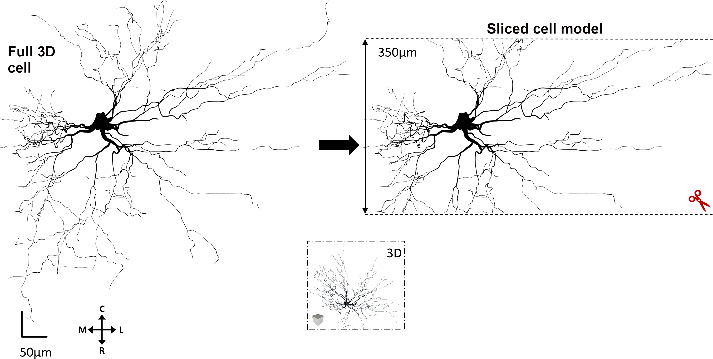

# Estimating-the-effects-of-slicing-on-the-electrophysiological-properties-of-spinal-motoneurons-under-normal-and-disease-conditions
This readme file is to assist in running the simulations published in the modeling study entitled <b><i>“Estimating the effects of slicing on the electrophysiological properties of spinal motoneurons under normal and disease conditions”</i></b> by Mohamed H. Mousa and Sherif M. Elbasiouny.

### Paper Overview:
The research paper investigates the impact of tissue slicing on the measurement of electrophysiological properties using a sharp electrode. The study explores this phenomenon in both healthy and diseased morphologies of spinal motorneurons.

 

## Platform:
* Files are written in hoc & Python. 
* Requires Python2.7.
* Run the simulations on the  [NEURON simulator](https://neuron.yale.edu/neuron/what_is_neuron) platform.

*update*: Python 3, can be used after converting the files using the [2to3](https://docs.python.org/3/library/2to3.html) package.

## Requirments:
1. [Install](https://www.neuron.yale.edu/neuron/static/py_doc/programming/python.html) the neuron simulator with Python 2.7 
2. Compile the mod files.

## Files description
* .hoc files are for the full and the sliced models of MN#3 from [Amendola and Durand (2008)](https://onlinelibrary.wiley.com/doi/full/10.1002/cne.21818)
* .mod files are for the active channels included in the cell models
* CaPIC.py files are for adding the dendritic CaPIC channels.
* Auto_start.py is to load the intact or the sliced cell, and add the CaPIC channels

## Published article
* [JNP Article](https://journals.physiology.org/doi/full/10.1152/jn.00543.2020)

